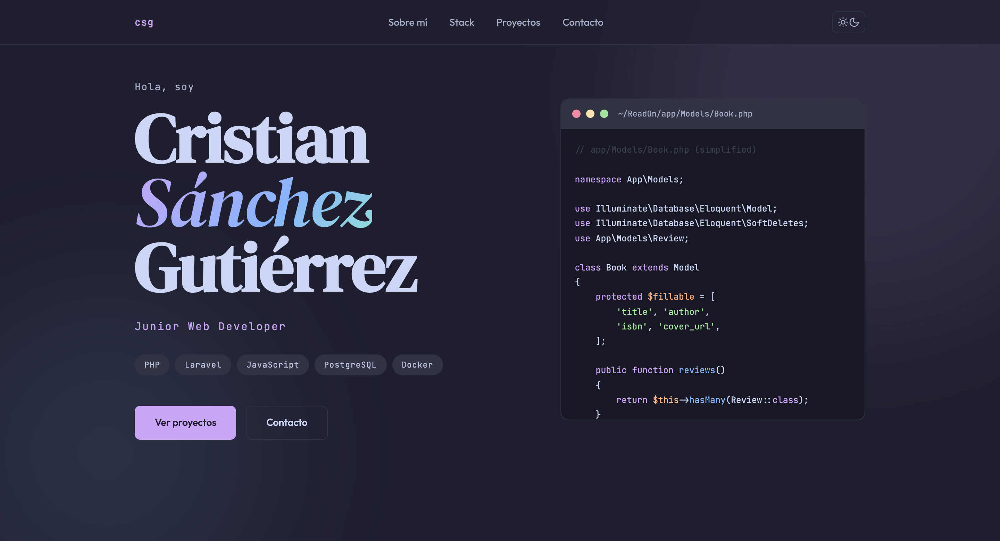

# cristiansg.dev

[](https://astro.build)
[](https://catppuccin.com)
[](https://vercel.com)

Portfolio personal de [Cristian Sánchez Gutiérrez](https://cristiansg.dev) — Junior Web Developer con experiencia full-stack en PHP/Laravel y React/TypeScript.



## Stack

- **[Astro](https://astro.build)** — generación estática
- **CSS** — estilos con paleta Catppuccin Mocha/Latte
- **Vercel** — despliegue continuo desde `main`

## Desarrollo local
```bash
npm install
npm run dev        # dev server en localhost:4321
npm run build      # build de producción
npm run preview    # preview del build
```

## Estructura
```
src/
├── components/    # Componentes Astro reutilizables
├── layouts/       # Layouts base
├── pages/         # Rutas (index.astro)
└── styles/        # CSS global y variables
public/            # Assets estáticos
```

## Proyectos incluidos

| Proyecto | Demo | Stack | Repo |
|---|---|---|---|
| **ReadOn**<br><sub>*App de seguimiento y reseña de lecturas con Google Books API*</sub> | [readon.cristiansg.dev](https://readon.cristiansg.dev) |      | [CristianSG2/ReadOn](https://github.com/CristianSG2/ReadOn) |
| **Ledgr**<br><sub>*Gestor de finanzas personales full-stack: JWT, transacciones, presupuestos con alertas, recurrentes, dashboard*</sub> | [ledgr.cristiansg.dev](https://ledgr.cristiansg.dev) |      | [CristianSG2/ledgr](https://github.com/CristianSG2/ledgr) |
| **Efeméride Diaria**<br><sub>*Juego web diario de adivinar el año de eventos históricos reales, sin base de datos*</sub> | [efemeride.cristiansg.dev](https://efemeride.cristiansg.dev) |      | [CristianSG2/efemeride](https://github.com/CristianSG2/efemeride) |
| **rutameteo**<br><sub>*Pronóstico del tiempo por tramos en tu ruta de conducción*</sub> | [rutameteo.cristiansg.dev](https://rutameteo.cristiansg.dev) |     | [CristianSG2/rutameteo](https://github.com/CristianSG2/rutameteo) |

## Contacto

[cristiansg.dev@gmail.com](mailto:cristiansg.dev@gmail.com) · [LinkedIn](https://linkedin.com/in/cristiansanchezgut)